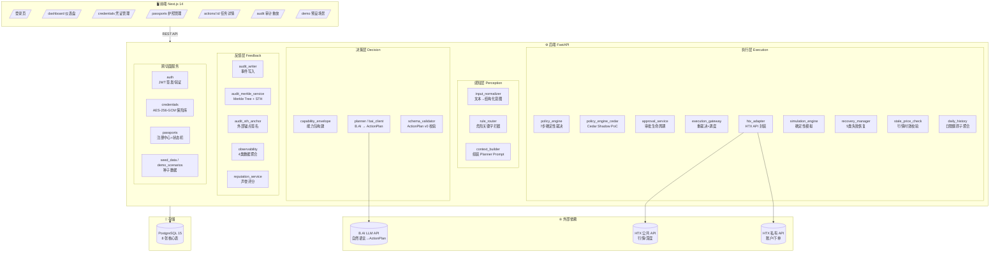
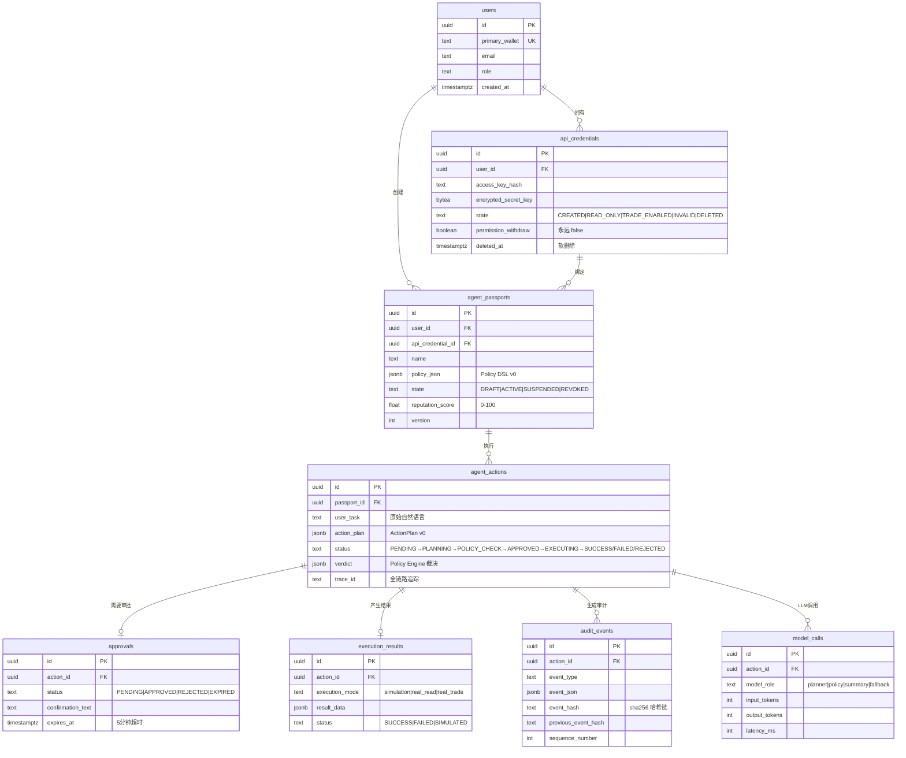
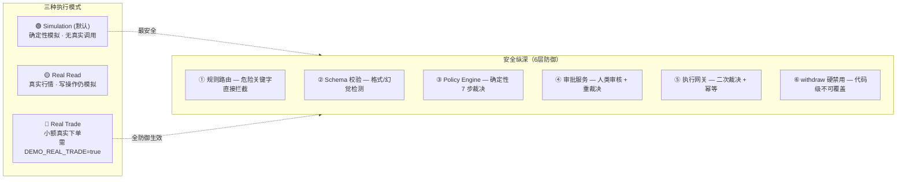
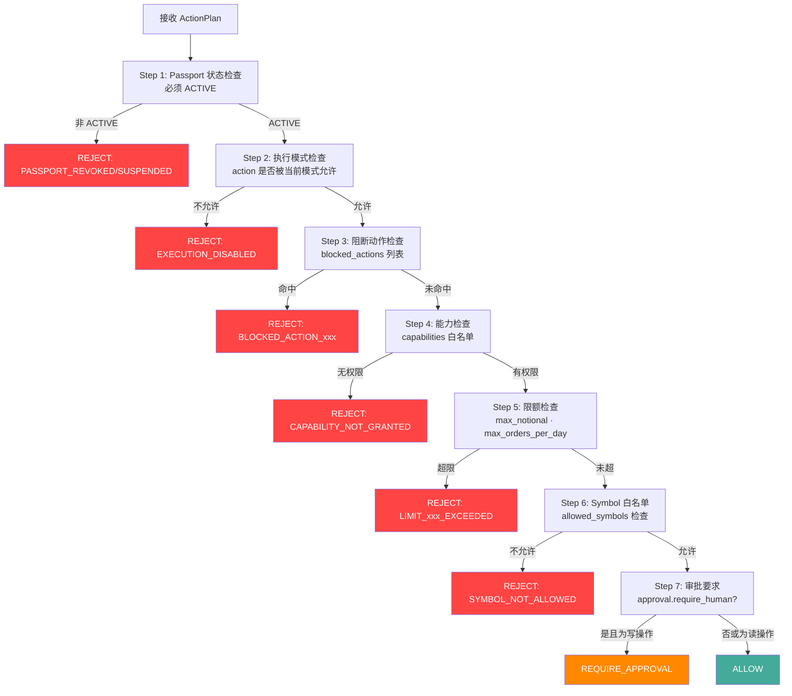
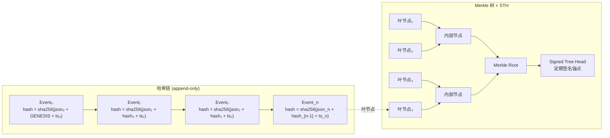

# HTX Agent Passport — 项目全景图与流程图

## 一、项目全景概览

```
┌─────────────────────────────────────────────────────────────────────────────┐
│                        HTX Agent Passport 系统全景                          │
│            "权限 · 风险 · 审计" 的 AI 代理控制平面                          │
├─────────────────────────────────────────────────────────────────────────────┤
│                                                                             │
│  ┌─────────────────────────────────────────────────────────────────────┐   │
│  │                    前端 (Next.js 14 App Router)                      │   │
│  │                                                                     │   │
│  │  /              登录页（演示入口）                                   │   │
│  │  /dashboard     仪表盘（Passport 列表 + 环境徽章）                  │   │
│  │  /credentials   凭证管理（添加/验证/删除 HTX API Key）              │   │
│  │  /passports     护照向导（创建/编辑 Policy）                        │   │
│  │  /actions/[id]  任务详情（实时状态 + 审批流 + 执行结果）            │   │
│  │  /audit         审计重放（哈希链验证 + STH 锚点）                   │   │
│  │  /demo          预设场景（一键演示）                                 │   │
│  │                                                                     │   │
│  │  组件: NavBar | EnvironmentBadge | PassportCard | PolicyEditor      │   │
│  │        TaskComposer | ApprovalModal | AuditTimeline | FeedbackLayer │   │
│  │        CredentialForm | STHViewer                                    │   │
│  └─────────────────────────────────────────────────────────────────────┘   │
│                              │ HTTP API                                     │
│                              ▼                                              │
│  ┌─────────────────────────────────────────────────────────────────────┐   │
│  │                    后端 (FastAPI + Python 3.11)                      │   │
│  │                                                                     │   │
│  │  ┌──────────────────────────────────────────────────────────────┐  │   │
│  │  │ 感知层 (Perception)                                          │  │   │
│  │  │   input_normalizer → rule_router → context_builder           │  │   │
│  │  └──────────────────────────────────────────────────────────────┘  │   │
│  │  ┌──────────────────────────────────────────────────────────────┐  │   │
│  │  │ 决策层 (Decision)                                            │  │   │
│  │  │   capability_envelope → planner (B.AI) → schema_validator    │  │   │
│  │  └──────────────────────────────────────────────────────────────┘  │   │
│  │  ┌──────────────────────────────────────────────────────────────┐  │   │
│  │  │ 执行层 (Execution)                                           │  │   │
│  │  │   policy_engine → approval_service → execution_gateway       │  │   │
│  │  │   htx_adapter / simulation_engine / recovery_manager         │  │   │
│  │  └──────────────────────────────────────────────────────────────┘  │   │
│  │  ┌──────────────────────────────────────────────────────────────┐  │   │
│  │  │ 反馈层 (Feedback)                                            │  │   │
│  │  │   audit_writer → audit_merkle → observability → reputation   │  │   │
│  │  └──────────────────────────────────────────────────────────────┘  │   │
│  │                                                                     │   │
│  │  跨切面: auth | credentials_vault | passport_registry | daily_hist │   │
│  └─────────────────────────────────────────────────────────────────────┘   │
│                              │                                              │
│              ┌───────────────┼───────────────┐                             │
│              ▼               ▼               ▼                             │
│  ┌────────────────┐  ┌────────────┐  ┌───────────────┐                    │
│  │  PostgreSQL 15 │  │  B.AI LLM  │  │  HTX Exchange │                    │
│  │  (8 tables)    │  │  API       │  │  (Pub + Priv) │                    │
│  └────────────────┘  └────────────┘  └───────────────┘                    │
│                                                                             │
└─────────────────────────────────────────────────────────────────────────────┘
```

---

## 二、核心业务流程图（端到端 Happy Path）

```mermaid
flowchart TD
    %% ===== 用户入口 =====
    START([用户打开应用]) --> LOGIN{已登录?}
    LOGIN -->|否| DEMO_LOGIN[点击"进入演示"<br/>POST /api/auth/demo-login]
    DEMO_LOGIN --> JWT[签发 JWT + 写入 USER_LOGIN 审计事件]
    JWT --> DASH
    LOGIN -->|是| DASH[仪表盘<br/>显示环境徽章 + Passport 列表]

    %% ===== 凭证管理 =====
    DASH --> CRED{有 HTX 凭证?}
    CRED -->|否| ADD_CRED[添加 API 凭证<br/>AES-256-GCM 加密存储]
    ADD_CRED --> VALIDATE[验证凭证能力<br/>READ_ONLY / TRADE_ENABLED / INVALID]
    VALIDATE --> WITHDRAW_CHECK{有 withdraw 权限?}
    WITHDRAW_CHECK -->|是| FORCE_DISABLE[强制 permission_withdraw=false<br/>写入审计覆盖记录]
    WITHDRAW_CHECK -->|否| CRED_READY
    FORCE_DISABLE --> CRED_READY[凭证就绪]
    CRED -->|是| CRED_READY

    %% ===== 创建护照 =====
    CRED_READY --> PASSPORT{有 Passport?}
    PASSPORT -->|否| CREATE_PP[创建代理护照<br/>选择模板 + 自定义 Policy DSL v0]
    CREATE_PP --> PP_READY[Passport ACTIVE<br/>绑定 Policy + 凭证 + 声誉分]
    PASSPORT -->|是| PP_READY

    %% ===== 任务提交 =====
    PP_READY --> SUBMIT_TASK[用户提交自然语言任务<br/>POST /api/passports/:id/actions]

    %% ===== 感知层 =====
    SUBMIT_TASK --> NORMALIZE[输入归一化器<br/>提取结构化意图]
    NORMALIZE --> RULE_ROUTE{规则路由<br/>高置信危险关键字?}
    RULE_ROUTE -->|是: 提现/借贷| BLOCK[直接拒绝<br/>REJECT + BLOCKED_ACTION]
    RULE_ROUTE -->|否| CTX_BUILD[上下文构建器<br/>注入 policy + market_snapshot + 时间]

    %% ===== 决策层 =====
    CTX_BUILD --> PLANNER[B.AI Planner 调用<br/>返回 ActionPlan v0 JSON]
    PLANNER --> PLANNER_FAIL{B.AI 可用?}
    PLANNER_FAIL -->|否| MOCK_PLAN[降级 Mock Planner<br/>返回 no_op ActionPlan]
    PLANNER_FAIL -->|是| SCHEMA_VAL[ActionPlan Schema 校验<br/>v0 格式 + 条件必填]
    MOCK_PLAN --> SCHEMA_VAL
    SCHEMA_VAL --> SCHEMA_PASS{校验通过?}
    SCHEMA_PASS -->|否| HALLUCINATION[标记 PLAN_HALLUCINATION<br/>写入审计 + 拒绝]
    SCHEMA_PASS -->|是| POLICY_ENGINE

    %% ===== 执行层 - 策略裁决 =====
    POLICY_ENGINE[Policy Engine 裁决<br/>7 步确定性评估] --> VERDICT{verdict?}
    VERDICT -->|REJECT| REJECT_ACTION[拒绝 + reason_codes<br/>写入审计事件]
    VERDICT -->|ALLOW| AUTO_EXEC[自动执行<br/>仅限 read 操作]
    VERDICT -->|REQUIRE_APPROVAL| APPROVAL

    %% ===== 审批流 =====
    APPROVAL[创建审批请求<br/>展示 risk_score + 详情] --> USER_DECIDE{用户决定}
    USER_DECIDE -->|REJECT| USER_REJECT[用户拒绝<br/>action → REJECTED]
    USER_DECIDE -->|过期 5min| TIMEOUT[审批超时<br/>action → EXPIRED]
    USER_DECIDE -->|APPROVE<br/>typed_confirmation| RE_EVALUATE

    %% ===== 执行前重裁决 =====
    RE_EVALUATE[执行网关重裁决<br/>真实 daily_history + 行锁] --> RE_PASS{仍然 ALLOW?}
    RE_PASS -->|否| STALE_REJECT[拒绝: 策略/限额变化]
    RE_PASS -->|是| EXEC_MODE

    %% ===== 执行模式分发 =====
    EXEC_MODE{执行模式?}
    EXEC_MODE -->|simulation| SIM[模拟引擎<br/>确定性 fake 结果]
    EXEC_MODE -->|real_read| REAL_READ[HTX 公共 API<br/>真实行情数据]
    EXEC_MODE -->|real_trade| REAL_TRADE[HTX 私有 API<br/>小额真实下单]

    %% ===== 结果处理 =====
    SIM --> RESULT
    REAL_READ --> RESULT
    REAL_TRADE --> RESULT
    AUTO_EXEC --> RESULT

    RESULT[写入执行结果<br/>更新 action 状态] --> AUDIT[写入审计哈希链事件<br/>sha256(json + prev_hash + ts)]
    AUDIT --> REPUTATION[更新声誉分<br/>成功+1 / 被拒-3 / 失败-5]
    REPUTATION --> FEEDBACK[前端分层反馈<br/>进度 → 批次 → 风险 → 最终]

    %% ===== 失败恢复 =====
    PLANNER --> RECOVERY{执行异常?}
    EXEC_MODE --> RECOVERY
    RECOVERY -->|是| RECOVERY_MGR[恢复管理器<br/>5类失败处理策略]
    RECOVERY_MGR --> CHECKPOINT[检查点回滚/重试/降级]

    %% ===== 审计重放 =====
    FEEDBACK --> REPLAY[审计重放界面<br/>完整决策链路可视化]

    %% 样式
    style BLOCK fill:#f44,color:#fff
    style REJECT_ACTION fill:#f44,color:#fff
    style HALLUCINATION fill:#f44,color:#fff
    style STALE_REJECT fill:#f44,color:#fff
    style USER_REJECT fill:#f44,color:#fff
    style TIMEOUT fill:#f80,color:#fff
    style POLICY_ENGINE fill:#4a9,color:#fff
    style AUDIT fill:#38f,color:#fff
    style REPLAY fill:#38f,color:#fff
```

---

## 三、系统架构图（分层详解）



---

## 四、数据模型关系图



---

## 五、执行模式与安全分层



---

## 六、Policy Engine 7 步裁决流程



---

## 七、审计哈希链与 Merkle 树



---

## 八、项目模块全景

### 后端服务模块 (29个)

| 模块 | 层 | 职责 |
|------|------|------|
| `input_normalizer` | 感知 | NL → 结构化意图 |
| `context_builder` | 感知 | 组装 Planner Prompt |
| `capability_envelope` | 决策 | Passport → 能力包 |
| `planner` / `bai_client` | 决策 | B.AI 调用 + 降级 |
| `policy_engine` | 执行 | 确定性 7 步裁决 |
| `policy_engine_cedar` | 执行 | Cedar 形式化验证 (shadow) |
| `policy_validator` | 执行 | Policy DSL v0 结构校验 |
| `policy_diagnostics` | 执行 | 策略诊断 + reason_codes 累积 |
| `approval_service` | 执行 | 审批生命周期管理 |
| `execution_gateway` | 执行 | 重裁决 + 调度执行 |
| `htx_adapter` | 执行 | HTX API 封装 (mock/real) |
| `simulation_engine` | 执行 | 确定性模拟结果 |
| `stale_price_check` | 执行 | 行情时效校验 |
| `daily_history` | 执行 | 日限额原子聚合 (行锁) |
| `recovery_manager` | 执行 | 5 类失败恢复 |
| `tool_executor` | 执行 | 工具调用分发 |
| `audit_writer` | 反馈 | 审计事件写入 |
| `audit_merkle_service` | 反馈 | Merkle Tree 构建 |
| `audit_sth_anchor` | 反馈 | STH 外部锚点 |
| `audit_sth_scheduler` | 反馈 | 定时 STH 签名 |
| `observability` | 反馈 | 4 类可观测数据 |
| `reputation_service` | 反馈 | 声誉评分更新 |
| `credentials` | 跨切面 | 凭证 CRUD + 加密 |
| `credential_usage` | 跨切面 | 凭证使用限额 |
| `passports` | 跨切面 | Passport 注册中心 |
| `seed_data` | 跨切面 | 种子数据生成 |
| `demo_scenarios` | 跨切面 | 预设演示场景 |

### 前端页面 & 组件 (7页 + 10组件)

| 页面 / 组件 | 功能 |
|-------------|------|
| `/` (page.tsx) | 登录入口，"进入系统"按钮 |
| `/dashboard` | Passport 卡片列表 + 环境模式 |
| `/credentials` | 凭证添加/验证/管理 |
| `/passports` | 创建/编辑护照 + Policy 编辑器 |
| `/actions/[id]` | 单次任务全流程可视化 |
| `/audit` | 审计链浏览 + 哈希验证 + STH |
| `/demo` | 一键预设场景触发 |
| `NavBar` | 全局导航 + 用户信息 |
| `EnvironmentBadge` | DEMO/SIMULATION/REAL 模式标识 |
| `PassportCard` | Passport 摘要卡片 |
| `PolicyEditor` | Policy DSL v0 可视化编辑 |
| `TaskComposer` | 自然语言任务输入框 |
| `ApprovalModal` | 审批确认弹窗 |
| `AuditTimeline` | 审计事件时间轴 |
| `FeedbackLayer` | 分层反馈（进度/风险/结果） |
| `CredentialForm` | 凭证表单 |
| `STHViewer` | Signed Tree Head 查看器 |

---

## 九、实施波次总览

```mermaid
gantt
    title 实施波次 (24 核心任务 · 全部已完成 ✅)
    dateFormat X
    axisFormat %s

    section Wave 1
    项目脚手架           :done, 1, 2

    section Wave 2
    数据库模型+迁移      :done, 2, 3
    演示认证             :done, 2, 3

    section Wave 3
    凭证保险库           :done, 3, 4
    Policy DSL           :done, 3, 4
    审计哈希链           :done, 3, 4
    HTX适配器+模拟引擎   :done, 3, 4

    section Wave 4
    ActionPlan Schema    :done, 4, 5
    可观测性+声誉        :done, 4, 5

    section Wave 5
    Policy Engine        :done, 5, 6
    输入归一化+路由      :done, 5, 6
    前端:认证+护照       :done, 5, 6

    section Wave 6
    Planner适配器        :done, 6, 7
    审批服务             :done, 6, 7
    恢复管理器           :done, 6, 7
    L2/L3/L5测试         :done, 6, 7

    section Wave 7
    执行网关             :done, 7, 8
    前端:任务+审批       :done, 7, 8
    前端:审计重放        :done, 7, 8

    section Wave 8
    Demo种子+场景        :done, 8, 9

    section Wave 9
    L4端到端测试         :done, 9, 10

    section Wave 10
    README+验收          :done, 10, 11
```



---

## 十、关键设计决策

| 决策 | 选择 | 理由 |
|------|------|------|
| LLM 输出处理 | 仅作为提案，不直接执行 | 零信任原则：确定性 Policy Engine 做最终裁决 |
| 策略引擎 | 确定性 Python（非规则引擎） | 可审计、可测试、无随机性 |
| 密钥存储 | AES-256-GCM + Envelope Encryption | 金融级安全标准 |
| 审计证据 | 哈希链 + Merkle Tree + STH | 防篡改 + 第三方可验证 |
| 执行模式 | 三模式分离 | 演示安全：默认不碰真实资金 |
| Withdraw | 代码级硬禁用 | 不可通过策略/配置开启提现 |
| B.AI 降级 | Mock Planner 返回 no_op | 外部依赖失败不阻断演示 |
| 审批超时 | 5 分钟自动过期 + 执行前重裁决 | 防止 stale state 被利用 |
